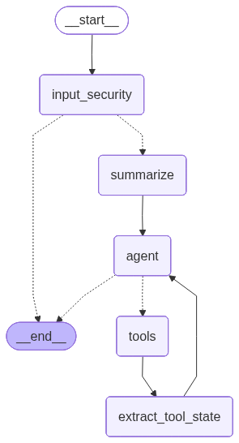

# 📚 Book Buddy

Book Buddy is a playful, single-user book recommendation app that turns your Goodreads export into a reading companion.

You bring your Goodreads export. Book Buddy does the rest: it enriches your library with metadata from OpenLibrary + Google Books, builds local vector stores, and lets you:
- ask what you should read next based on the books you already loved
- check whether a specific title matches your taste before you commit
- save promising picks to a "read later" list
- search that list by mood, theme, or vibe at any time later  

> What you should know
> - Requires a **Goodreads export CSV** (other CSV formats are not supported)
> - **Single-user** only (local stores, no accounts)
> - Some requests can take **up to ~1 minute** (external lookups + scoring)
> - Uses **OpenAI APIs** for chat + embeddings (may incur cost)

## ✨ Why Book Buddy (and what you get)

If you read a lot, you likely already have a strong signal of what you love in Goodreads: the books you finished and the ones you rated highly. The frustration is that generic recommendation engines can be unpredictable, and simple filters (genre/year/rating) don’t capture the nuance of why something feels like a good next read.

Book Buddy uses your Goodreads export as the grounding source, enriches it with better metadata, and runs a tool-driven workflow so suggestions stay anchored in your actual taste.

What this gives you:
- more on-target recommendations grounded in your own library
- quick taste checks before you commit to a book
- a save-and-search read later list you can query by mood, theme, or vibe

### 💬 Example Questions

Get recommendations:
- "What should I read next?"
- "Suggest books like my favorites."
- "Recommend something similar to Dune."

Check a specific book via title, author or ISBN:
- "Does Project Hail Mary fit my style?"
- "Check 9780553386790 for me."
- "Does The Night Circus by Erin Morgenstern fit my taste?"

Search your to-read list:
- "I am today in the mood for something romantic."
- "Show me sci-fi from my list."
- "Anything cozy and light?"

## 🚀 Quickstart

```bash
uv sync
```

Set your OpenAI key (pick one approach):

```bash
export OPENAI_API_KEY="..."
```

Or create a local `.env`:

```text
OPENAI_API_KEY=...
```

Run the app:

```bash
uv run streamlit run main.py
```

## How it works

1) You upload your Goodreads export CSV.
2) Each row is enriched via Google Books + OpenLibrary (descriptions, subjects, ratings, etc.).
3) Your library is embedded into a local Chroma vector store.
4) A LangGraph agent routes your request to the right tool.
5) Results are returned in plain language (no raw JSON, no similarity distances in chat).

### First run: import your Goodreads export CSV

Goodreads is a platform for tracking, rating, and reviewing books. Book Buddy relies on the official Goodreads export CSV to learn your reading history.

Download your Goodreads CSV:

1) Log in to Goodreads.
2) Go to [`https://www.goodreads.com/review/import`](https://www.goodreads.com/review/import).
3) Click "Export Library" and download the CSV.

Important:

- The app can only be used if you have a Goodreads export CSV.
- Other CSV formats are not supported.
- First run creates your library store at `data/chroma`.
- Upload/ingestion can take a few minutes for large libraries because the app enriches books via external APIs.

### Read later list

- When you save your first recommendation, Book Buddy creates a second store at `data/chroma_to_read`.
- After that, you can search your saved list by mood, theme, or vibe using semantic similarity.

## 🏛️ Architecture

### Graphflow: how a message becomes an answer

Every chat message goes through the same pipeline:  
`Input security` -> `Optional summarization` -> `Agent decision` -> `Tool execution (if needed)` -> `Validated response`.



What happens in practice:

1) **Input security**: checks for prompt injection patterns and wraps your message in strict delimiters.
2) **Summarization**: if the conversation gets long, older messages are summarized to keep context stable.
3) **Agent decision**: the model either answers directly or calls one of the tools.
4) **Tools loop**: tools fetch/enrich/score, update state (recent recommendations and checked books), and the agent continues until it can respond.
5) **Output validation**: the final text is filtered for prompt leakage / suspicious patterns before it is shown.

This keeps responses grounded in your library while reducing prompt-injection risk and keeping long chats manageable.

### 🧰 Tools, scoring, and matching

The agent has four tools. It chooses which one to call based on your question:

- `recommend_by_profile`: generate recommendations from your library profile.
- `enrich_and_score`: check if a specific book matches your taste.
- `save_to_read_list`: save selected titles.
- `query_to_read_list`: search your saved to-read list based on mood, theme, or vibe.

#### Scoring and fuzzy matching

*Subject preference scoring*  
Used to pick which subjects to recommend from.

`score = (#5-star * 1.0) + (#4-star * 0.6) + (#3-star * 0.2) + (#1-2-star * 0.0)`

*Vector similarity scoring*  
Used to rank candidates and search saved lists.

- Candidates are embedded and compared via Chroma similarity search.
- Lower distance means more similar.

*Fuzzy matching*  
Used to align results across APIs and match partial titles.

`match_score = 0.75 * title_similarity + 0.25 * author_similarity`

### Tool pipelines (collapsed)

These are the internal steps inside each tool.

<details>
<summary><code>recommend_by_profile</code> - Recommend books from your taste profile</summary>

```text
+----------------------------------------------------------------------+
| 1) Load library vector store (Chroma)                                |
| 2) Extract subjects + Goodreads ratings from stored metadata         |
| 3) Compute weighted subject scores and pick top subjects             |
| 4) Fetch candidate works from OpenLibrary (plus related subjects)    |
| 5) Deduplicate candidates across subjects                            |
| 6) Enrich candidates via Google Books                                |
| 7) Filter out already-read books and already-saved to-read books     |
| 8) Score remaining candidates by vector similarity to your library   |
| 9) Return ranked candidates to the agent                             |
+----------------------------------------------------------------------+
```

Where scoring/matching is used:

- Subject preference scoring: step 3
- Fuzzy matching: step 6 (select best Google Books match)
- Vector similarity scoring: step 8

</details>

<details>
<summary><code>enrich_and_score</code> - Check if a specific book fits your taste</summary>

```text
+----------------------------------------------------------------------+
| 1) Normalize title / author / ISBN                                   |
| 2) Fetch candidate from Google Books (ISBN or title+author)          |
| 3) Enrich with OpenLibrary (subjects, ratings, extra metadata)       |
| 4) Score fit via vector similarity search against your library store |
| 5) Return enriched summary + similarity scores to the agent          |
+----------------------------------------------------------------------+
```

Where scoring/matching is used:

- Fuzzy matching: step 3 (OpenLibrary work-key resolution uses fuzzy title/author matching)
- Vector similarity scoring: step 4

</details>

<details>
<summary><code>save_to_read_list</code> - Save titles using fuzzy matching</summary>

```text
+----------------------------------------------------------------------+
| 1) Read recent context (last recommendations or last checked books)  |
| 2) Fuzzy match your provided title(s) to those results               |
| 3) Create to-read entries with a short reason, why book selected     |
| 4) Persist entries to the to-read vector store                       |
| 5) Return how many were saved                                        |
+----------------------------------------------------------------------+
```

Where scoring/matching is used:

- Fuzzy matching: step 2 (RapidFuzz; threshold `>= 70`)
- Vector similarity scoring: not computed here, but step 3 can reuse similarity matches from earlier tools to create the reason

</details>

<details>
<summary><code>query_to_read_list</code> - Search saved books by mood/theme</summary>

```text
+----------------------------------------------------------------------+
| 1) Load to-read vector store (Chroma)                                |
| 2) Run semantic similarity search for your query                     |
| 3) Return top matches to the agent                                   |
+----------------------------------------------------------------------+
```

Where scoring/matching is used:

- Vector similarity scoring: step 2

</details>

### 🌐 API clients and BookDataService

- `GoogleBooksClient`: pulls rich metadata (descriptions, ratings, page count).
- `OpenLibraryClient`: resolves work keys and fetches subjects, editions, ratings.
- `BookDataService`: orchestrates both so tools can enrich books consistently.

### 🗄️ Vector stores (where data lives)

- Library vector store: `data/chroma` (created on first run after CSV upload)
- To-read vector store: `data/chroma_to_read` (created when you save your first recommendation)

### 🛡️ Security

- Prompt injection detection blocks common attack patterns.
- Structured prompt wrapper isolates user input inside explicit delimiters.
- Output validation filters responses that resemble prompt leakage or sensitive data.

## ⚠️ Disclaimers and limitations

- Uses OpenAI APIs for chat + embeddings; usage may incur cost.
- Some requests can take up to ~1 minute due to external API calls
- External APIs may rate-limit or temporarily fail.
- Single-user only (local stores, no accounts)
- Requires Goodreads export CSV
- Recommendation quality depends on your ratings and available metadata

## 📦 Libraries used

Core:
- streamlit
- langgraph
- langchain
- langchain-openai
- chromadb / langchain-chroma

<details>
<summary>Other dependencies</summary>
- pandas
- rapidfuzz
- requests
- loguru
- langsmith
- langgraph-cli
- pytest

</details>

## ✅ Prerequisites

- Python 3.12+
- `uv`
- `OPENAI_API_KEY`
- Network access to Google Books and OpenLibrary

## 🧭 Project structure

- `main.py` - Streamlit entry point
- `src/ui` - UI layout, upload flow, chat interface
- `src/graph` - LangGraph agent, prompts, tool routing
- `src/graph/tools` - Tool implementations
- `src/api` - Google Books + OpenLibrary clients and service layer
- `src/vectorstore` - Chroma stores, ingestion, state management
- `src/security` - Prompt-injection detection and output validation
- `docs` - Diagram
